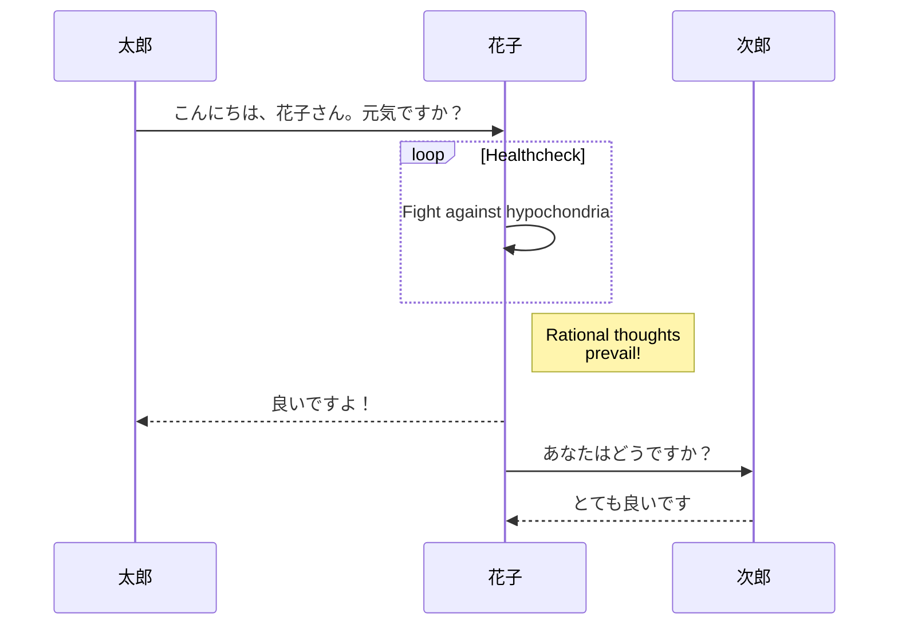
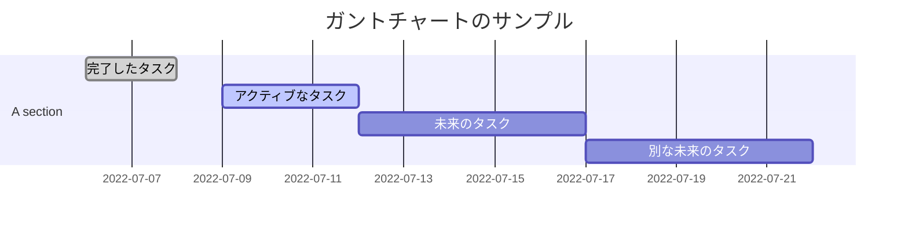
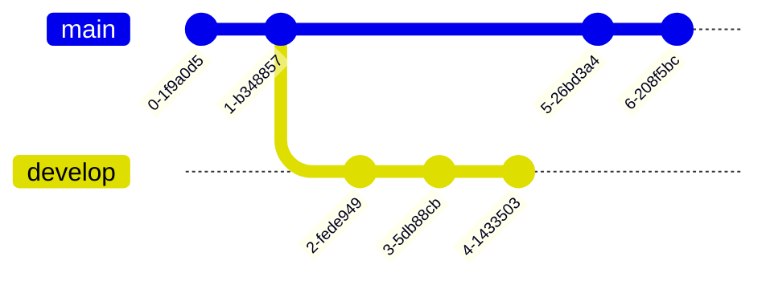
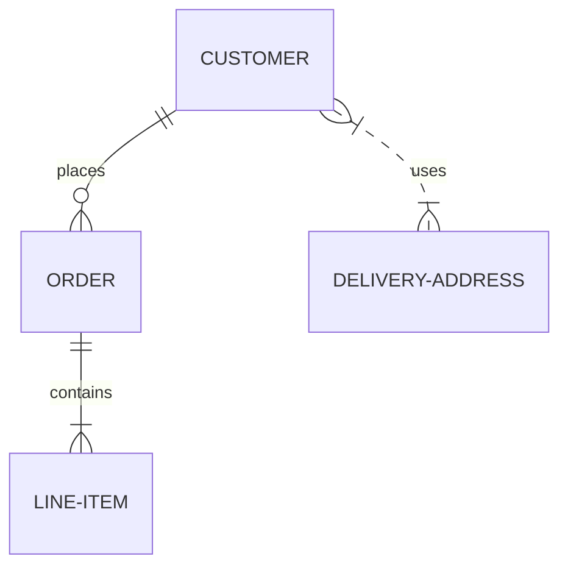
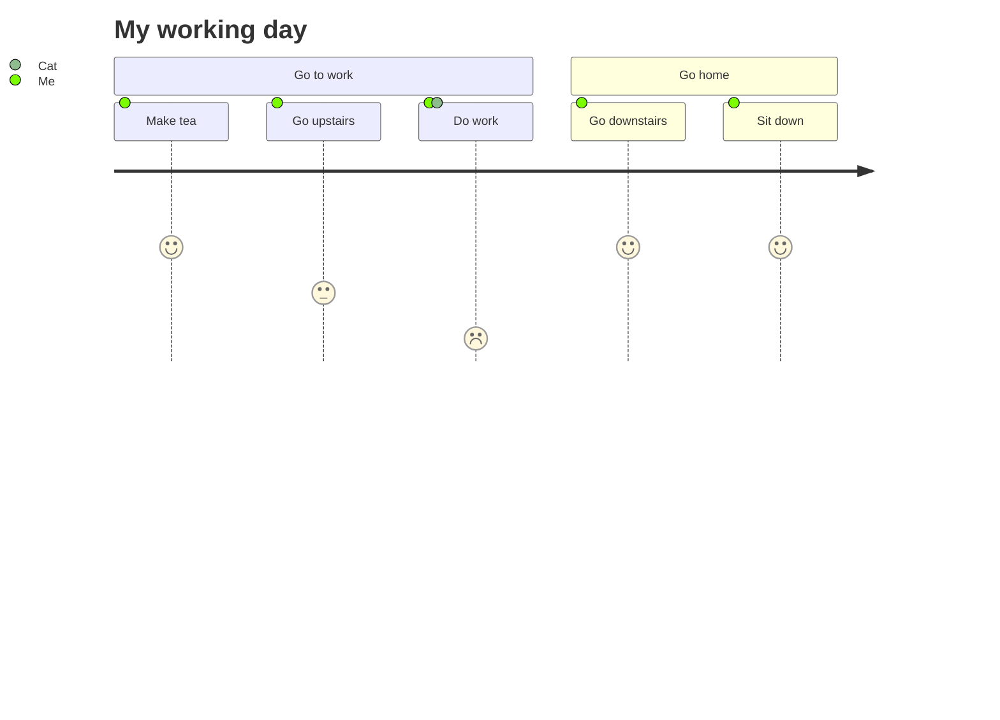
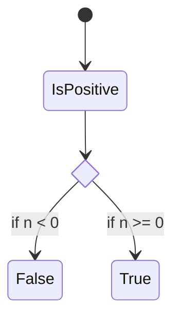
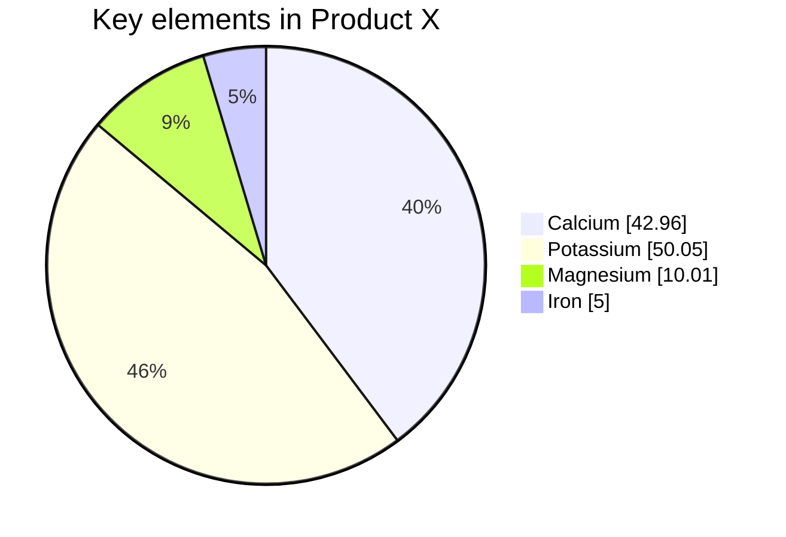
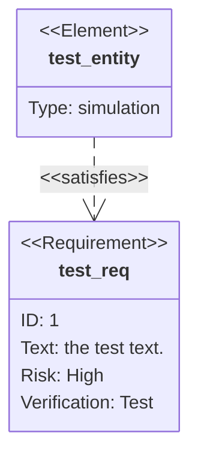

# example

- [example](#example)
  - [フローチャート](#フローチャート)
  - [シーケンス図](#シーケンス図)
  - [ガントチャート](#ガントチャート)
  - [クラス図](#クラス図)
  - [Gitグラフ](#gitグラフ)
  - [ER図](#er図)
  - [ユーズジャーニー図](#ユーズジャーニー図)
  - [ステータス図](#ステータス図)
  - [円グラフ](#円グラフ)
  - [要件図](#要件図)

## フローチャート

```markdown
graph TD;
    A-->B;
    A-->C;
    B-->D;
    C-->D;
```


## シーケンス図

```markdown
sequenceDiagram
    participant 太郎
    participant 花子
    太郎->>花子: こんにちは、花子さん。元気ですか？
    loop Healthcheck
        花子->>花子: Fight against hypochondria
    end
    Note right of 花子: Rational thoughts <br/>prevail!
    花子-->>太郎: 良いですよ！
    花子->>次郎: あなたはどうですか？
    次郎-->>花子: とても良いです
```



## ガントチャート

```markdown
gantt
dateFormat  YYYY-MM-DD
title ガントチャートのサンプル
excludes weekdays 2014-01-10

section A section
完了したタスク            :done,    des1, 2022-07-06,2022-07-08
アクティブなタスク        :active,  des2, 2022-07-09, 3d
未来のタスク              :         des3, after des2, 5d
別な未来のタスク          :         des4, after des3, 5d
```



## クラス図

```markdown
Class diagram
classDiagram
Class01 <|-- AveryLongClass : Cool
Class03 *-- Class04
Class05 o-- Class06
Class07 .. Class08
Class09 --> C2 : Where am i?
Class09 --* C3
Class09 --|> Class07
Class07 : equals()
Class07 : Object[] elementData
Class01 : size()
Class01 : int chimp
Class01 : int gorilla
Class08 <--> C2: Cool label
```

```mermaid
Class diagram
classDiagram
Class01 <|-- AveryLongClass : Cool
Class03 *-- Class04
Class05 o-- Class06
Class07 .. Class08
Class09 --> C2 : Where am i?
Class09 --* C3
Class09 --|> Class07
Class07 : equals()
Class07 : Object[] elementData
Class01 : size()
Class01 : int chimp
Class01 : int gorilla
Class08 <--> C2: Cool label
```

## Gitグラフ

```markdown
    gitGraph
       commit
       commit
       branch develop
       commit
       commit
       commit
       checkout main
       commit
       commit
```



## ER図

```markdown
erDiagram
    CUSTOMER ||--o{ ORDER : places
    ORDER ||--|{ LINE-ITEM : contains
    CUSTOMER }|..|{ DELIVERY-ADDRESS : uses
```



## ユーズジャーニー図

```markdown
journey
    title My working day
    section Go to work
      Make tea: 5: Me
      Go upstairs: 3: Me
      Do work: 1: Me, Cat
    section Go home
      Go downstairs: 5: Me
      Sit down: 5: Me
```



## ステータス図

```markdown
stateDiagram-v2
    state if_state <<choice>>
    [*] --> IsPositive
    IsPositive --> if_state
    if_state --> False: if n < 0
    if_state --> True : if n >= 0
```



## 円グラフ



## 要件図

```markdown
requirementDiagram

    requirement test_req {
    id: 1
    text: the test text.
    risk: high
    verifymethod: test
    }

    element test_entity {
    type: simulation
    }

    test_entity - satisfies -> test_req
```


