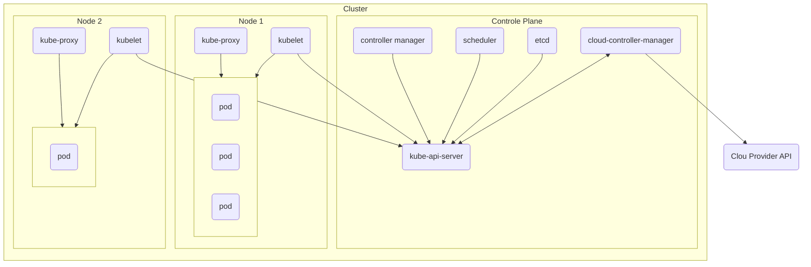

# Kubernetes

- https://kubernetes.io/ja/docs/concepts/architecture/

```mermaid
flowchart TD
    subgraph C[Cluster]
        subgraph CP[Controle Plane]
            ccm(cloud-controller-manager)
            e(etcd)
            kas(kube-api-server)
            s(scheduler)
            cm(controller manager)

            ccm <--> kas
            e --> kas
            s --> kas
            cm --> kas
        end
        subgraph N_1[Node 1]
            kl1(kubelet)
            kp1(kube-proxy)
            subgraph CRI_1[ ]
                p1(pod)
                p2(pod)
                p3(pod)
            end
            kl1 --> kas
            kl1 --> CRI_1
            kp1 --> CRI_1
        end
        subgraph N_2[Node 2]
            kl2(kubelet)
            kp2(kube-proxy)
            subgraph CRI_2[ ]
                p4(pod)
            end
            kl2 --> kas
            kl2 --> CRI_2
            kp2 --> CRI_2
        end
    end
    cpa(Clou Provider API)
    ccm --> cpa
```
