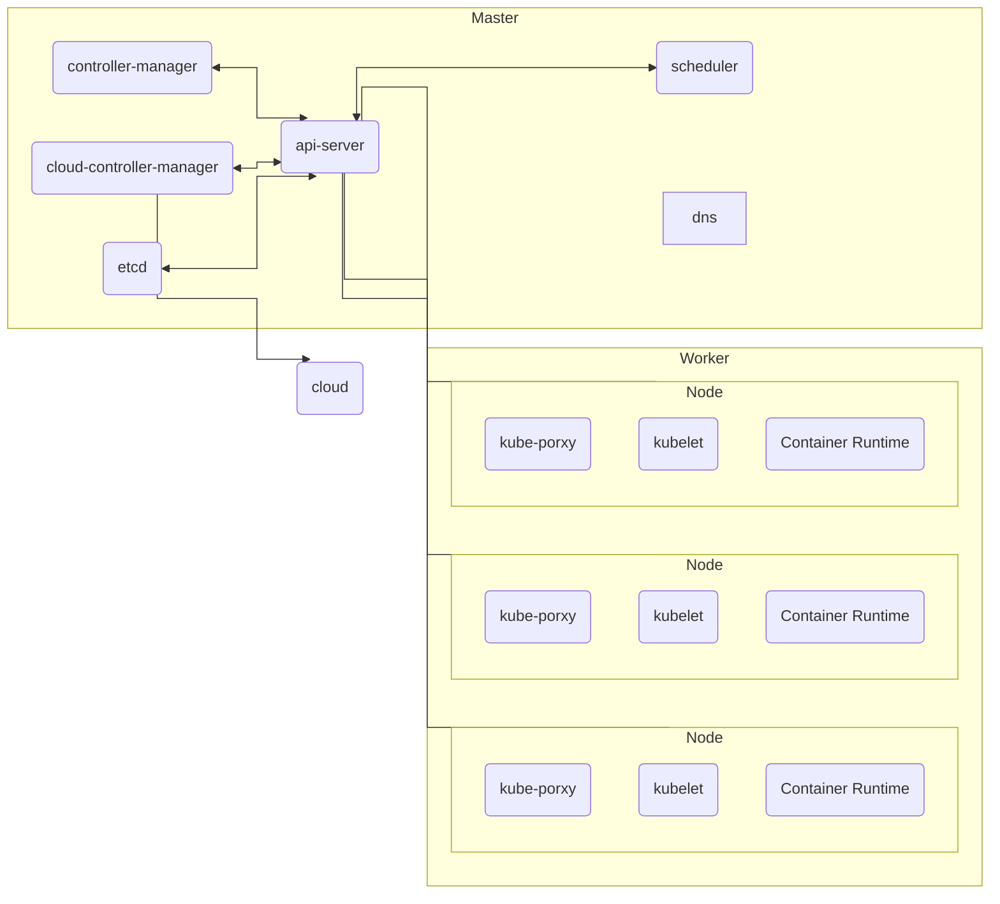

# Kubernetes

```mermaid
%%{ init: { 'flowchart': { 'curve': 'stepBefore' } } }%%
flowchart LR
    c(cloud)
    subgraph M[Master]
        cm(controller-manager)
        ccm(cloud-controller-manager)
        e(etcd)
        as(api-server)
        s(scheduler)
        dns

        cm <--> as
        ccm <--> as
        e <--> as
        as <--> s
    end
    subgraph W[Worker]
        subgraph N_1[Node]
            kp1(kube-porxy)
            kl1(kubelet)
            cr1(Container Runtime)
        end
        subgraph N_2[Node]
            kp2(kube-porxy)
            kl2(kubelet)
            cr2(Container Runtime)
        end
        subgraph N_3[Node]
            kp3(kube-porxy)
            kl3(kubelet)
            cr3(Container Runtime)
        end
    end
    ccm --> c
    as --- N_1
    as --- N_2
    as --- N_3
```
